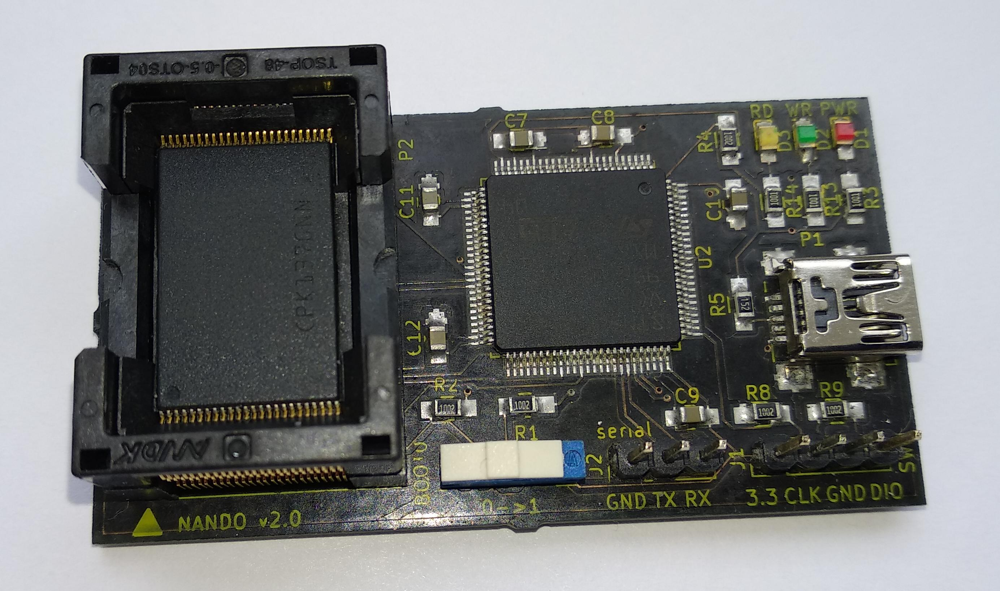
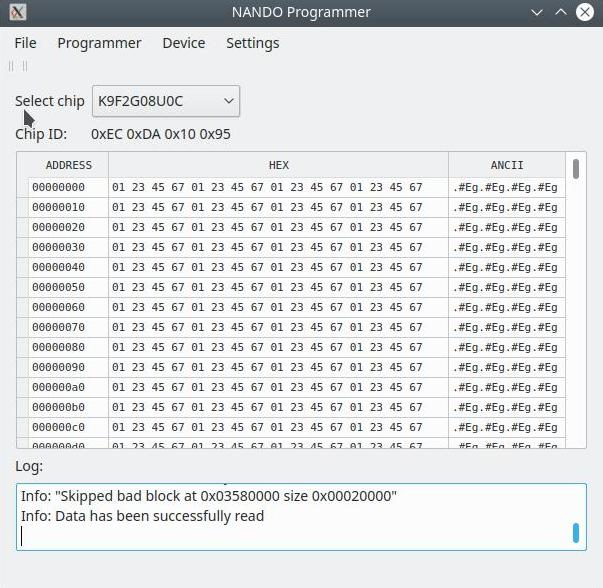
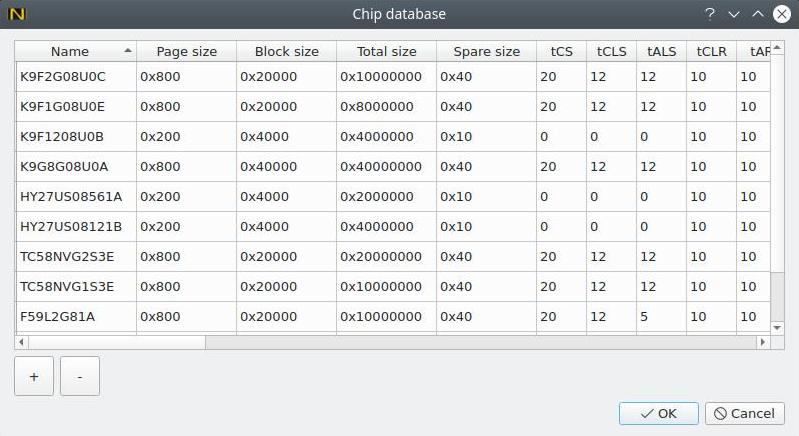

# NANDO (NANDopen) programmer

## General
NANDO is open source NAND programmer based on STM32 processor.

## Features
- USB interface
- PC client software for Linux & Windows.
- TSOP-48 socket for NAND chip
- 8 bit NAND interface
- 3.3V NAND power supply
- NAND read,write and erase support
- NAND read of chip ID support
- NAND read of bad blocks
- NAND bad block skip option
- Open KiCad PCB & Schematic
- Open source code
- Read & Write LEDs indication
- Write speed: 512KBytes/s
- Read speed: 640KBytes/s
- Erase speed: 256MBytes/s
- Extendable chip database

### Tested chips
- K9F2G08U0C

## Release binaries
You can download host application deb package for Ubuntu/Windows installer, firmware binary for
STM32, schematic and gerber files from here:

https://drive.google.com/drive/folders/1d5hP6MKbkEBGQe_xIRl4-A5LPt_-9QIN

### License
In general the sorce code, PCB and schematic are under GPLv3 license but with limitations of:

firmware/libs/spl/CMSIS/License.doc

firmware/libs/spl/STM32_USB-FS-Device_Driver/ - http://www.st.com/software_license_agreement_liberty_v2

firmware/usb_cdc - http://www.st.com/software_license_agreement_liberty_v2

# Build
## Requirements
Linux based OS
## Build firmware
1. Download compiler and documents from Google Drive:
- Go to https://drive.google.com/drive/folders/1zLtebfLW6CxaWMq0rr4EfEPmeXfGk-7n?usp=sharing
- Press "Download All"
- mkdir ~/dev/
- cd ~/dev/
- mv ~/Downloads/nand_programmer*.zip ./
- unzip nand_programmer-*.zip
- cd nand_programmer/compiler/
- tar -xvf gcc-arm-none-eabi-4_9-2015q1-20150306-linux.tar.bz2
- cd ..
- git clone https://github.com/bbogush/nand_programmer.git
- cd nand_programmer/firmware
- make
## Burn firmware via SWD (ST-Link)
- sudo apt-get install libusb-1.0-0-dev
- cd ~/dev/
- git clone https://github.com/texane/stlink.git
- cd stlink/
- mkdir -p build && cd build
- cmake -DCMAKE_BUILD_TYPE=Release ..
- sudo make install
- sudo cp ../etc/udev/rules.d/* /etc/udev/rules.d/
- sudo udevadm control --reload-rules
- sudo udevadm trigger
- connect ST-Link to board
- cd ~/dev/nand_programmer/nand_programmer/firmware
- st-flash write ./obj/prog.bin 0x8000000
## Build host application
- Install Qt5.5.1
- Open ~/dev/nand_programmer/nand_programmer/qt/qt.pro with QtCreator.
- Go to Projects->Build->Build Steps->Add Build Step->Make. Add "install" to "Make arguments".
- Build->Run qmake
- Build->Build All
- Build->Run
## Schematic and PCB
- Install KiCad 5.0.1
- Open ~/dev/nand_programmer/nand_programmer/kicad/nand_programmator.pro
## Adding new chip
- Go to Settings->Chip database
- Press "+" button and fill out parameters from datasheet.

