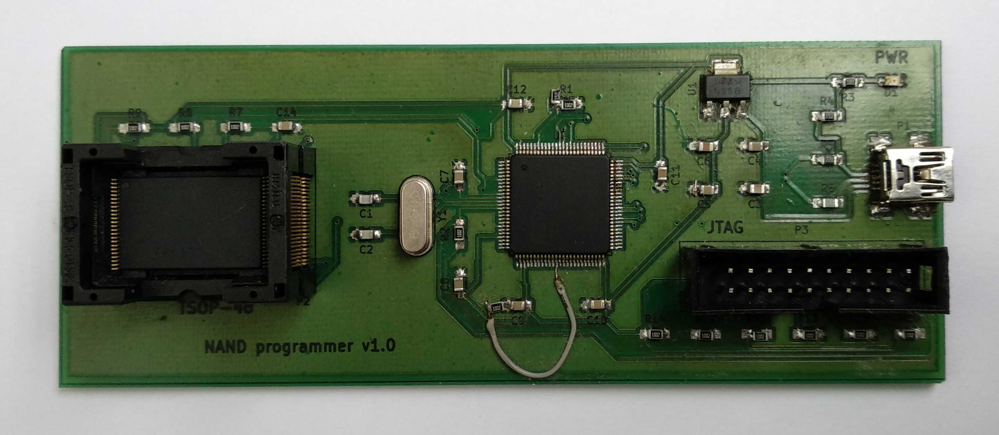
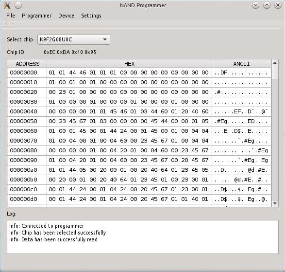

# NANDO (NANDopen) programmer

## General
NANDO is open source NAND programmer based on STM32 processor.

## Features
- USB interface
- PC client software for Linux.
- TSOP-48 socket for NAND chip
- NAND read,write and erase support
- NAND read of chip ID support
- Open KiCad PCB & Schematic
- Open source code
- Write speed: 512KBytes/s
- Read speed: 640KBytes/s
- Erase speed: 256MBytes/s

### Tested chips
- K9F2G08U0C

## Version
### Release 1.0
- Basic NAND operations support

Binaries: https://drive.google.com/drive/folders/1d5hP6MKbkEBGQe_xIRl4-A5LPt_-9QIN

### License
In general the sorce code, PCB and schematic are under GPLv3 license but with limitations of:

firmware/libs/spl/CMSIS/License.doc

firmware/libs/spl/STM32_USB-FS-Device_Driver/ - http://www.st.com/software_license_agreement_liberty_v2

firmware/usb_cdc - http://www.st.com/software_license_agreement_liberty_v2

# Build
## Requirements
Linux based OS
## Build firmware
1. Download compiler and documents from Google Drive:
- Go to https://drive.google.com/drive/folders/1zLtebfLW6CxaWMq0rr4EfEPmeXfGk-7n?usp=sharing
- Press "Download All"
- mkdir ~/dev/
- cd ~/dev/
- mv ~/Downloads/nand_programmer*.zip ./
- unzip nand_programmer-*.zip
- cd nand_programmer/compiler/
- tar -xvf gcc-arm-none-eabi-4_9-2015q1-20150306-linux.tar.bz2
- cd ..
- git clone https://github.com/bbogush/nand_programmer.git
- cd nand_programmer/firmware
- make
## Burn firmware
### JTAG (J-Link)
- connect JTAG (J-Link) to board.
- sudo apt-get install openocd
- cd ~/dev/nand_programmer/nand_programmer/firmware
- make program
- NOTE: first time flash of chip should be burnt via internal bootloader (DFU )because JTAG interface is not active.
### SWD (ST-Link)
- sudo apt-get install libusb-1.0-0-dev
- cd ~/dev/
- git clone https://github.com/texane/stlink.git
- cd stlink/
- make release
- cd build/Release
- sudo make install
- sudo cp ../../etc/udev/rules.d/* /etc/udev/rules.d/
- sudo udevadm control --reload-rules
- sudo udevadm trigger
- connect ST-Link to board
- cd ~/dev/nand_programmer/nand_programmer/firmware
- st-flash write ./obj/prog.bin 0x8000000
## Burn firmware (internal bootloader)
- download STM DFU programmer software.
- set BOOT0 switch to 1 to start internal bootloader.
- connect board to PC via USB interface.
- flash firmware.
- set BOOT0 switch to 0 to boot from flash.
## Build host application
- Install Qt5.5.1
- Open ~/dev/nand_programmer/nand_programmer/qt/qt.pro with QtCreator.
- Build->Run qmake
- Build->Build All
- Build->Run
## Schematic and PCB
- Install KiCad 5.0.1
- Open ~/dev/nand_programmer/nand_programmer/kicad/nand_programmator.pro
