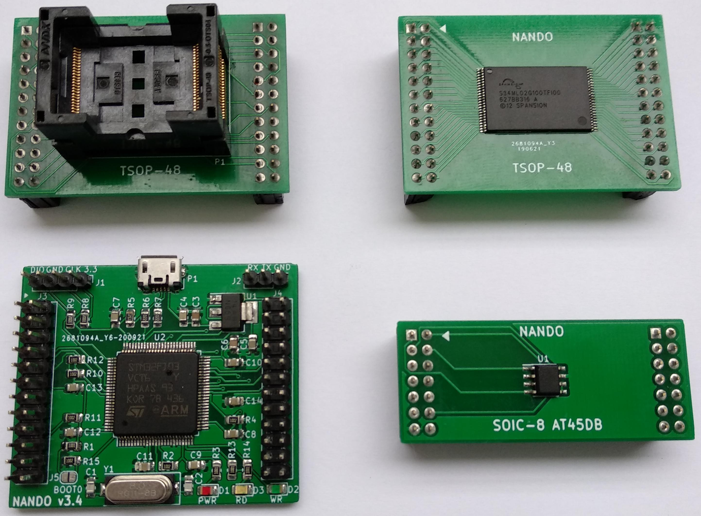
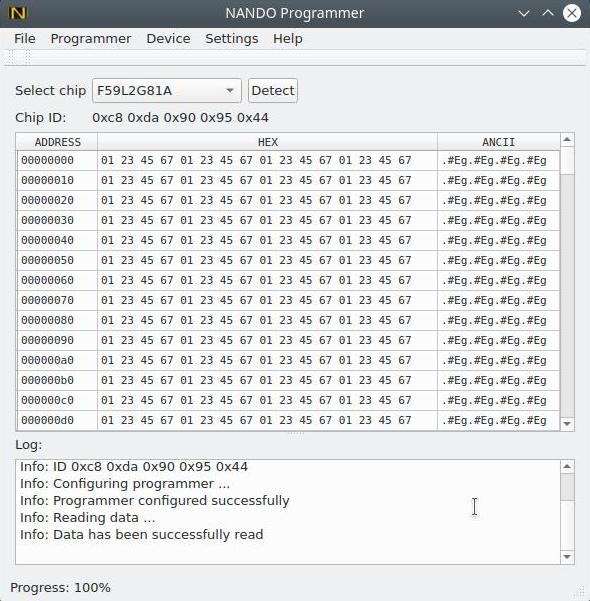

# NANDO (NANDopen) programmer

## General
NANDO is open source NAND programmer based on STM32 processor. It supports parallel NAND and SPI flash programming.

PCB boards:

Application:

## Features
- USB interface
- PC client software for Linux & Windows.
- TSOP-48 socket adapter for NAND chip (compatible with TL866 adapter)
- TSOP-48 solder adapter for NAND chip
- 8 bit parallel NAND interface
- SPI interface
- 3.3V NAND power supply
- NAND read,write and erase support
- NAND read of chip ID support
- NAND read of bad blocks
- NAND bad block skip option
- NAND include spare area option
- Open KiCad PCB & Schematic
- Open source code
- Read & Write LEDs indication
- Extendable chip database
- Chip autodetection
- Firmware update

### Supported chips
#### Parallel NAND:
K9F2G08U0C, HY27US08121B, TC58NVG2S3E, F59L2G81A, MX30LF2G18AC and others.

See full list of supported chips [qt/nando_parallel_chip_db.csv](qt/nando_parallel_chip_db.csv)

#### SPI flash
AT45DB021D, MX25L8006E, W25Q16JV and others.

See full list of supported chips [qt/nando_spi_chip_db.csv](qt/nando_spi_chip_db.csv)

## Release binaries
You can download host application deb package for Ubuntu/Windows installer, firmware binary for
STM32, schematic and gerber files from <a href="https://drive.google.com/drive/folders/1d5hP6MKbkEBGQe_xIRl4-A5LPt_-9QIN">Google Driver</a>.

### License
In general the sorce code, PCB and schematic are under GPLv3 license but with limitations of:

firmware/libs/spl/CMSIS/License.doc

firmware/libs/spl/STM32_USB-FS-Device_Driver/ - http://www.st.com/software_license_agreement_liberty_v2

firmware/usb_cdc - http://www.st.com/software_license_agreement_liberty_v2

## WiKi
Check [WiKi](https://github.com/bbogush/nand_programmer/wiki) page for more information.
